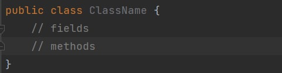
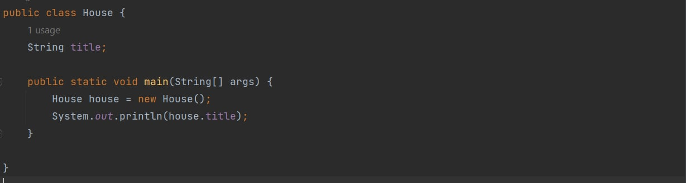
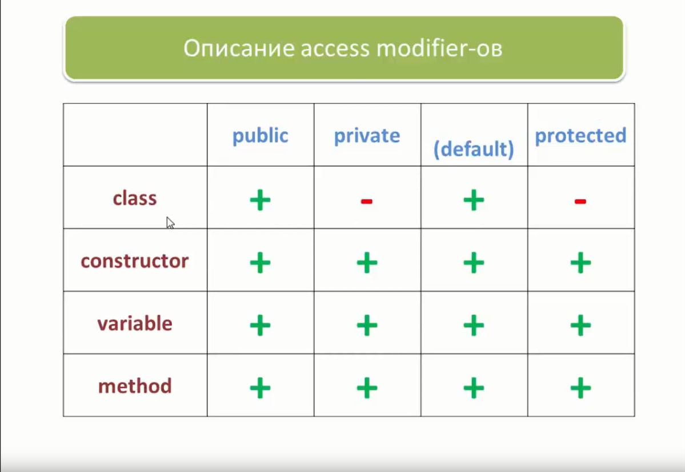
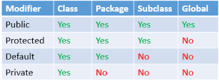
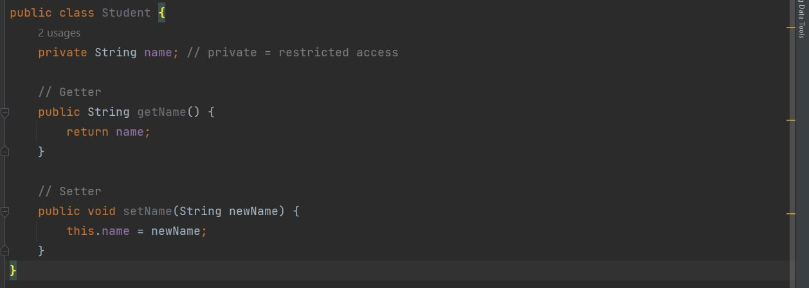
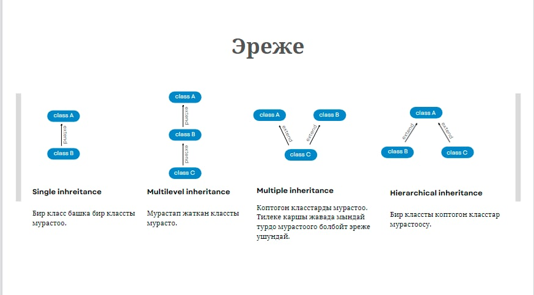
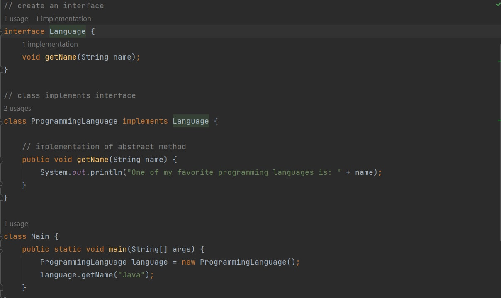

### **_Mukhammed Asantegin_**  | JAVA OOP

### Java тилинде объектиге багытталган программалоо
* ### Объектке багытталган программалоо деген эмне?
Объектке багытталган программалоо (OOP) - бул 
" объекттер " түшүнүгүнө негизделген фундаменталдык программалоо парадигмасы .
Бул объекттер поле түрүндөгү маалыматтарды жана процедуралар түрүндөгү кодду 
(көбүнчө методдор катары белгилүү) камтышы мүмкүн.

Объектке багытталган мамиленин негизги концепциясы татаал маселелерди майда объекттерге бөлүү болуп саналат.

* ### Парадигма деген эмне?
Бул программалоо стили.( Подход к програмированию) .

1. _Java деген эмне?
2. Класс деген эмне?
3. Объект деген эмне?
4. Java Virtual Machine (JVM) деген эмне?
5. Мүмкүнчүлүк өзгөрткүчтөрү Java'да кантип иштешет.
6. Java'да конструкторлор кантип иштешет.
7. Java'да методдор кантип иштейт.
8. ООПнун негизги принциптери.
9. Java тилиндеги интерфейстер._

* ### Java деген эмне?
Java бул Windows, Mac жана Linux сыяктуу ар кандай операциялык системаларда иштеген жалпы максаттуу, класска негизделген, объектиге багытталган программалоо тили.

Вы можете использовать Java для разработки:

1. Настольные приложения
2. Веб-приложения
3. Мобильные приложения (особенно приложения для Android)
4. Веб-серверы и серверы приложений
5. Обработка больших данных
6. Встроенные системы

И многое другое.

* ### Javaдагы класс деген эмне?
Класс объекттердин жыйындысы катары аныкталат. Сиз ошондой эле классты жеке объект түзө турган план катары ойлосоңуз болот.

Класс түзүү үчүн биз **class** ачкыч сөздү колдонобуз.

### Java тилиндеги класстын синтаксиси:

Жогорудагы синтаксисте бизде объекттин абалын жана жүрүм-турумун чагылдырган полялар (өзгөрмөлөр деп да аталат) жана методдор бар.

Көңүл буруңуз , Javaда биз маалыматтарды сактоо үчүн поляларды колдонобуз, ал эми операцияларды аткаруу үчүн методдорду колдонобуз.

Класс ар дайым чоң тамга менен башталышы керек жана Java файлы класстын аталышына дал келиши керек экенин эске алыңыз.

* ### Javaдагы объект деген эмне?
Объект – бул реалдуу дүйнөдөгү объект, аны так аныктоого болот. Объекттердин абалы жана жүрүм-турумдары бар. Башкача айтканда, алар белгилүү бир типтеги маалыматтарды пайдалуу кылуу үчүн метод жана свойствадан турат.

Объект төмөнкүлөрдөн турат:

* **Уникалдуу иденттүүлүк:** Ар бир объект башка объекттин абалына окшош болсо да, уникалдуу идентификацияга ээ.
* **Состояние/Свойства/Атрибуты:** Мамлекет бизге объект кандай көрүнөрүн же анын кандай касиеттери бар экенин айтып берет.
* **Жүрүм-турум(Поведение:):** Жүрүм-турум бизге объект эмне кылып жатканын айтып берет.

**Java объектисинин абалынын жана жүрүм-турумунун мисалдары:**
Келгиле, объекттер ээ боло турган абалдардын жана жүрүм-турумдун айрым реалдуу мисалдарын карап көрөлү.

1-мисал:
Объект: унаа.
Мамлекет: түсү, бренди, салмагы, модели.
Жүрүм-туруму: сындыруу, ылдамдатуу, айлануу, тиштерин алмаштыруу.
2-мисал:
Объект: үй.
Мамлекет: дареги, түсү, жайгашкан жери.
Жүрүм-туруму: ачык эшик, жабык эшик, ачык жалюзи.

**Java тилиндеги объекттин синтаксиси:**

* ### Java Virtual Machine (JVM) деген эмне?
Java виртуалдык машинасы (JVM) бул компьютерге Java программаларын иштетүүгө мүмкүндүк берген виртуалдык машина.

JVM эки негизги функциясы бар, алар:

1. Java программаларын каалаган түзмөктө же операциялык системада иштетүүгө уруксат берүү үчүн (бул "Бир жолу жаз, каалаган жерде иштет" принциби катары да белгилүү).
2. Жана программа эс тутумун башкаруу жана оптималдаштыруу.

* ### Модификаторы доступа(Access Modifiers) Javaда кантип иштейт?
Java тилинде кирүү модификаторлору класстардын, методдордун жана башка мүчөлөрдүн жеткиликтүүлүгүн орнотуучу ачкыч сөздөр.

Бул ачкыч сөздөр класстагы поле же методду башка класста же суб-класста башка ыкма менен колдонууга же чакырууга болорун аныктайт.

Кирүү модификаторлору кирүү мүмкүнчүлүгүн чектөө үчүн да колдонулушу мүмкүн.
(Модификаторы доступа также могут использоваться для ограничения доступа.)

**Javaда бизде кирүү модификаторлорунун төрт түрү бар, алар:**

1. Default
2. Public
3. Private
4. Protected

**Default Access Modifier**
Модификатор доступа по умолчанию также называется package-private. Сиз аны бир пакеттеги бардык мүчөлөрдү көрүнөө кылуу үчүн колдоносуз, бирок аларга бир эле топтомдун ичинде гана кирүүгө болот.

Класс, метод же маалымат мүчөсү үчүн эч кандай мүмкүндүк модфикатору көрсөтүлбөсө же жарыяланбаса, ал автоматтык түрдө **default** кирүү модификаторун алат.

**Public Access Modifier**
Модификатор доступа public класска, методго же маалымат полясына Java программасындагы каалаган класстан же пакеттен жеткиликтүү болууга мүмкүндүк берет. Модификатор доступа public пакеттин ичинде да, пакеттин сыртында да жеткиликтүү.

Жалпысынан алганда, модификатор доступа public объектти таптакыр чектебейт.

**Private Access Modifier**
Модификатор закрытого доступа — это модификатор доступа с самым низким уровнем доступности. Это означает, что методы и поля, объявленные как закрытые, недоступны за пределами класса. Они доступны только внутри класса, членами которого являются эти частные объекты.

Вы также можете заметить, что частные сущности невидимы даже для подклассов класса.

**Protected Access Modifier**
Методдор жана маалымат мүчөлөрү жарыяланганда **protected**, биз аларга бир пакеттин ичинде, ошондой эле субкласстардан кире алабыз.

Биз ошондой эле   **protected**  модификатор кандайдыр бир жол менен **default** модификаторуна окшош деп айта алабыз. Бул жөн гана анын бир өзгөчөлүгү бар, бул анын субкласстарда көрүнүүсү.

Класстарды protected деп жарыялоого болбойт. Бул кирүү модификатору көбүнчө ата-эне менен баланын мамилесинде колдонулат.

* ### Javaдагы конструкторлор деген эмне?
Javaдагы конструктор - бул жаңы түзүлгөн объекттерди инициализациялоо үчүн колдонгон ыкма.

### Method main()

Ар бир Java программасы өзүнүн аткарылышын методдо баштайт main(). Ошентип, биз колдондук public static void main(String[] args), жана бул программанын аткарылышын баштаган жери. Башка сөз менен айтканда, main()ыкма ар бир Java программасынын кирүү чекити болуп саналат.

Анын синтаксиси ар дайым **public static void main(String[] args)**. Өзгөртүүгө мүмкүн болгон бир гана нерсе - сап массивинин аргументинин аты.

**public** ачкыч сөз.
public ачкыч сөз кирүү өзгөрткүчү болуп саналат . Анын ролу бул ыкмага кайдан кирүүгө болорун жана ага кире аларын көрсөтүү. Ошентип, биз методду жалпыга ачык кылганыбызда, ал аны дүйнөлүк жеткиликтүү кылат. Башкача айтканда, ал программанын бардык бөлүктөрү үчүн жеткиликтүү болуп калат.main()

**static** ачкыч сөз.
Метод статикалык ачкыч сөз менен жарыяланганда , ал статикалык метод деп аталат. Ошентип, Java main()методу дайыма статикалык болот, андыктан компилятор аны класстын объектисин түзбөстөн же ага чейин чакыра алат.

Эгерде метод статикалык эмес болууга уруксат берилсе, анда Java Virtual Machine методду main()чакырып жатканда өзүнүн классын түзүшү керек болот .main()

main()Статикалык ачкыч сөз дагы маанилүү, анткени ал Java Virtual Machine ыкмасын чакыруу үчүн гана жарыяланган объект тарабынан колдонула турган керексиз эстутумду үнөмдөйт .

**Void** ачкыч сөзү.
Void ачкыч сөзү - бул ыкма эч нерсе кайтарбасын көрсөтүү үчүн колдонулган ачкыч. Метод main()эч нерсе кайтара албаса, анын кайтаруу түрү жараксыз болуп саналат. Демек, бул main()ыкма аяктаары менен Java программасы да токтойт дегенди билдирет.

Негизги.
Main - Java негизги методунун аталышы. Бул Java Virtual Machine Java программасынын баштапкы чекити катары издеген идентификатор.

The String[] args.
Бул Java буйрук сабынын аргументтерин сактаган саптардын массиви.

* ### Java'да методдор кантип иштейт
Метод - бул белгилүү бир тапшырманы аткарган код блогу. Java тилинде биз метод терминин колдонобуз, бирок C++ сыяктуу башка программалоо тилдеринде ошол эле ыкма көбүнчө функция катары белгилүү.

Javaда ыкмалардын эки түрү бар:

Колдонуучу тарабынан аныкталган методдор : Бул биздин талаптардын негизинде түзө турган методдор.
Стандарттык китепкана методдору : Бул Java-да колдонууга жеткиликтүү болгон орнотулган методдор.

* ### Объектке багытталган программалоонун негизги принциптери.
Объектке багытталган программалоонун парадигмасынын төрт негизги принциптери бар. Бул принциптер объектиге багытталган программалоонун түркүктөрү катары да белгилүү.

**Объектке багытталган программалоонун төрт негизги принциптери:**

1. Инкапсуляция 
2. Мурас
3. Абстракция
4. Полиморфизм

* ### Java'да инкапсуляция жана маалыматты жашыруу
Инкапсуляция - бул сиз өзүңүздүн маалыматтарыңызды бир бирдиктин астына жыйноо. Жөнөкөй сөз менен айтканда, ал аздыр-көптүр коргоочу калкан сыяктуу, бул калкандан тышкары код аркылуу берилиштерге кирүүгө жол бербейт.

Инкапсуляциянын жөнөкөй мисалы - мектеп сумкасы. Мектеп сумкасы китептериңиз, калемдериңиз, карандашыңыз, сызгычыңыз жана башкалар сыяктуу бардык буюмдарыңызды бир жерде сактай алат.

Программалоодо маалыматты жашыруу  же маалыматты программанын ичиндеги ар кандай кокустан өзгөрүүдөн коргоо. Бул күчтүү объектиге багытталган программалоо өзгөчөлүгү жана ал инкапсуляция менен тыгыз байланышта.

**Инкапсуляциянын артында турган идея - бул " сезги " маалыматтарды колдонуучулардан жашыруу. Буга жетишүү үчүн:**

Класс өзгөрмөлөрүн/атрибуттарын **private** деп жарыялоо .
Өзгөрмөнүн маанисине жетүү жана жаңыртуу үчүн жалпыга ачык **get** жана **set** методдорун бериңиз . 
Эсиңизде болсун, private өзгөрмөлөргө бир класстын ичинде гана кирүүгө болот жана тышкы класс аларга кире албайт. Бирок get жана set методдору камсыз болсо, алар кире алат .

**Как работают методы get и set:**

* ### Javaдагы мурас | Inheritance in Java
Мурастоо класстарга башка класстардын атрибуттарын жана ыкмаларын мурастоого мүмкүндүк берет. Бул ата-энелер класстары балдар класстарына атрибуттарды жана жүрүм-турумду кеңейтет дегенди билдирет. Мурас кайра колдонуу мүмкүнчүлүгүн колдойт.

Биз "Мурас түшүнүгүн" эки категорияга топтойбуз:

* подкласс (бала) - башка класстан тукум кууп өткөн класс.
* суперкласс (ата-эне) - тукум кууп өткөн класс.

Эмнеге мурастоо керек?
Мурастоо кодубузду кыскартуу жана
класстардын мамилесин түзүү үчүн керек.

* ### Javaдагы абстракция
Абстракция – бул объектке багытталган программалоодогу концепция, ал сизге маанилүү поляларды гана көрсөтүүгө жана кодуңуздагы керексиз маалыматты жашырууга мүмкүндүк берет. Абстракциянын негизги максаты - колдонуучулардан керексиз маалыматтарды жашыруу.

Абстракцияны түшүндүрүүнүн жөнөкөй мисалы, сиз электрондук кат жөнөткөндө пайда боло турган процесс жөнүндө ойлонуу. Электрондук кат жөнөткөнүңүздө, ал жөнөтүлгөндө эмне болоору жана сервер колдонгон протокол сыяктуу татаал маалыматтар сизден жашырылат.

Сиз электрондук кат жөнөткөндө, сиз жөн гана кабыл алуучунун электрондук почта дарегин, электрондук почтанын темасын киргизип, мазмунду терип, жөнөтүү баскычын бастыңыз.

Сиз абстракттуу класстарды же интерфейстерди колдонуу менен  абстракцияга жете аласыз .

Ачкыч сөз abstract класстар жана методдор үчүн колдонулуучу жеткиликсиз модификатор болуп саналат:

* Абстракттуу класс: объекттерди түзүү үчүн колдонулушу мүмкүн эмес чектелген класс. Ага жетүү үчүн, ал башка класстан мураска алынышы керек.
* Абстракттуу метод: Денеси жок ыкма абстракттуу метод деп аталат. Биз абстракттуу ыкмаларды түзүү үчүн бир эле abstractачкыч сөздү колдонобуз.
Абстракттуу методдун негизги бөлүгү субкласс тарабынан камсыз кылынат (мурасталган).

* ### Java тилиндеги полиморфизм

Полиморфизм бир нерсенин көп формага ээ болуу жөндөмүн билдирет. Полиморфизм адатта бизде мурастоо боюнча бири-бири менен байланышкан көптөгөн класстар болгондо пайда болот.

Полиморфизм адамдын бир эле учурда ар кандай өзгөчөлүктөргө ээ болушуна окшош.

Мисалы, эркек бир эле учурда ата, чоң ата, күйөө, кызматкер жана башкалар боло алат. Ошентип, бир эле адам ар кандай кырдаалдарда ар кандай мүнөздөмөлөргө же жүрүм-турумга ээ.

**Мурас жана полиморфизм кодду кайра колдонуу үчүн абдан пайдалуу. Жаңы класс түзүп жатканда, учурдагы класстын поляларын жана методдорун кайра колдоно аласыз.**

* ### Java тилиндеги интерфейстер

An **interface** абстракттуу методдордун жыйындысы. Башка сөз менен айтканда,  бош денелер менен байланышкан методдорду топтоо үчүн колдонулган **interface** толугу менен " **абстрактуу класс** ".

Интерфейс класс эмне кыла аларын аныктайт, бирок аны кантип аткара албайт.

Мисалы:

